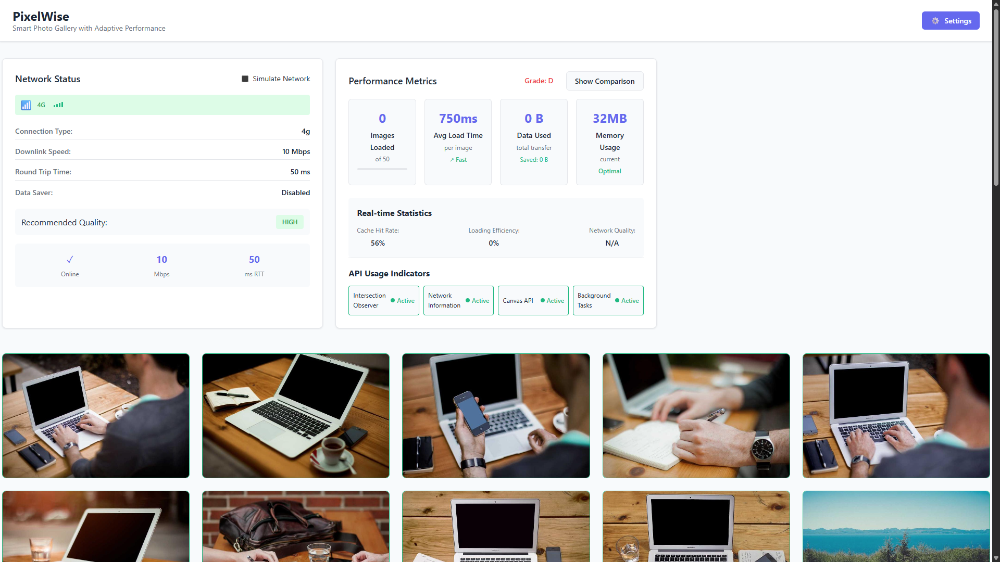
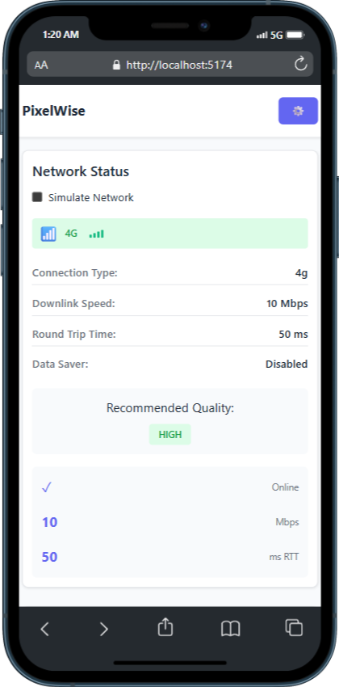
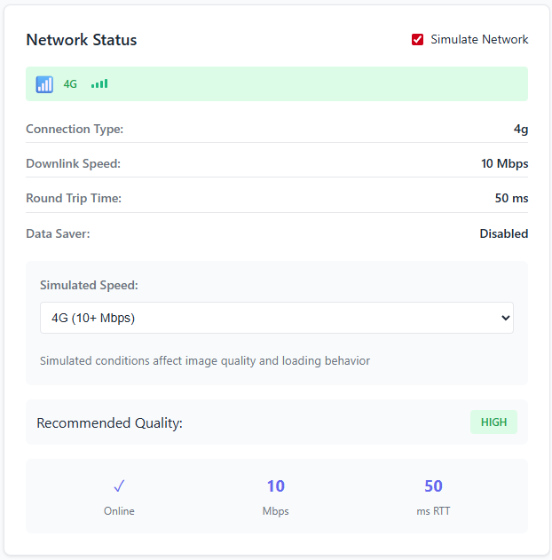
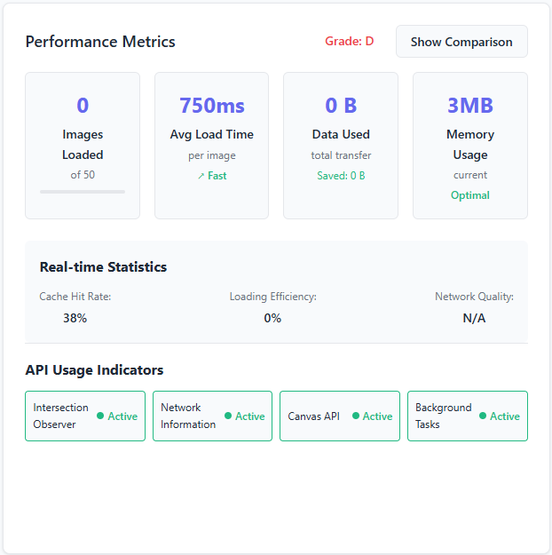
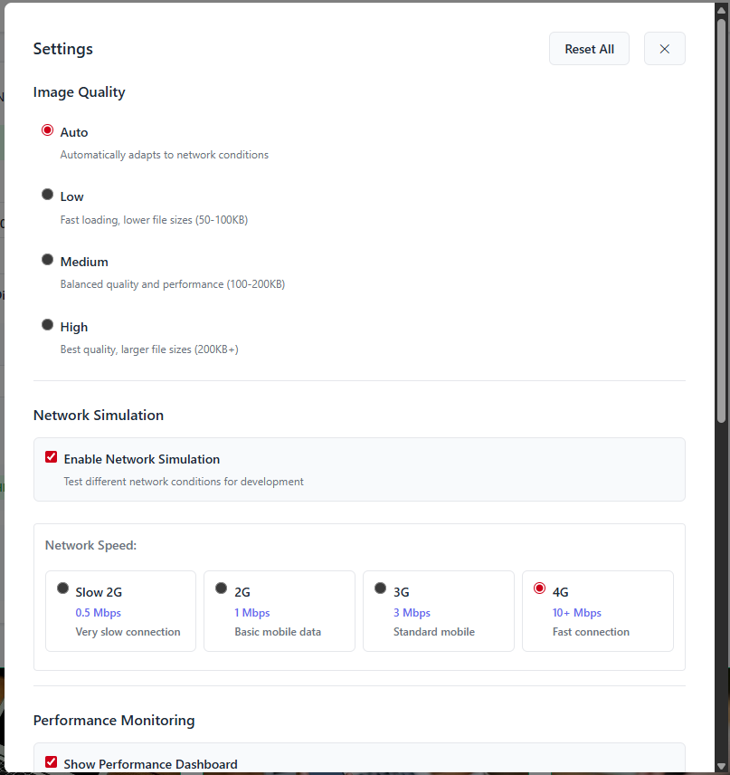

# Pixelwise - Intelligent Photo Gallery

A **React-based adaptive photo gallery** that intelligently optimizes user experience based on network conditions, device capabilities, and viewing behavior. Pixelwise automatically adjusts image quality, loading strategies, and performance metrics to deliver the best possible experience across all devices and connection speeds.

---

## 🌐 Live Demo & Screenshots

### Desktop Experience

*Full desktop view showing adaptive dashboard and responsive gallery*

### Mobile Experience  

*Mobile-optimized single-column layout with touch-friendly controls*

## 🎯 What Makes Pixelwise Smart

- **Network-Aware Loading**: Automatically detects 2G, 3G, 4G, and WiFi connections to optimize image quality  
- **Adaptive Performance**: Real-time monitoring and adjustment based on device capabilities  
- **Intelligent Lazy Loading**: Uses Intersection Observer API for efficient viewport-based loading  
- **Background Processing**: Leverages idle time for image optimization and preloading  
- **Canvas-Powered Editing**: Real-time image filters and effects without external dependencies  

---

## 🚀 Key Features

- **Real-time Metrics Dashboard**: Monitor loading times, data usage, and efficiency  
- **Network Simulation**: Test different connection scenarios for development  
- **Smart Quality Selection**: Automatically chooses optimal image quality based on network  
- **Progressive Loading**: LQIP (Low Quality Image Placeholders) → Full resolution  
- **Responsive Design**: Adapts from single-column mobile to multi-column desktop  
- **Performance Monitoring**: Comprehensive analytics with before/after comparisons  

### Network Intelligence

*Real-time network monitoring with adaptive quality recommendations*

### Performance Analytics

*Comprehensive performance tracking with before/after comparisons*

---

## 🛠️ Technology Stack

- **Frontend**: React 18 with modern hooks and component architecture  
- **Build Tool**: Vite for fast development and optimized production builds  
- **Styling**: Modern CSS with CSS Grid, Flexbox, and CSS Variables  
- **Web APIs**: Intersection Observer, Network Information, Canvas, Background Tasks, Geolocation  

---

## 🚀 Quick Start

```bash
# Clone the repository
git clone https://github.com/kkrishna007/PixelWise.git

# Navigate to project directory
cd pixelwise

# Install dependencies
npm install

# Start development server
npm run dev

# Build for production
npm run build
```
## 📱 Responsive Design

- **Desktop**: Multi-column dashboard with comprehensive metrics and full-featured settings  
- **Mobile**: Single-column layout optimized for touch with condensed dashboard  
- **Adaptive**: Settings button shows full text on desktop, icon-only (⚙️) on mobile  

---

## 🎛️ Configuration Options

### Advanced Settings Panel

*Comprehensive settings panel with network simulation and quality controls*

### Image Quality Settings

- **Auto**: Adapts automatically to network conditions  
- **Low**: Fast loading for slow connections (50–100KB)  
- **Medium**: Balanced quality and performance (100–200KB)  
- **High**: Maximum quality for fast connections (200KB+)  

### Network Simulation

Test different connection speeds:  
- **Slow 2G** (0.5 Mbps)  
- **2G** (1 Mbps)  
- **3G** (3 Mbps)  
- **4G** (10+ Mbps)  

---

## 📊 Performance Metrics

Pixelwise tracks and displays:

- Loading efficiency and average load times  
- Data usage with savings calculations  
- Memory usage and network quality assessment  
- Real-time API status indicators  

---

## 🌐 Browser Compatibility

- **Chrome/Edge**: 88+ (full feature support)  
- **Firefox**: 85+ (full feature support)  
- **Safari**: 14+ (limited Network Information API)  
- Graceful degradation for unsupported APIs  

---

## 🤝 Contributing

1. Fork the repository  
2. Create a feature branch  
   ```bash
   git checkout -b feature/amazing-feature
   ```
3. Commit your changes
   ```bash
   git commit -m 'Add amazing feature'
   ```
4. Push to the branch
   ```bash
   git push origin feature/amazing-feature
   ```
5. Open a pull request

